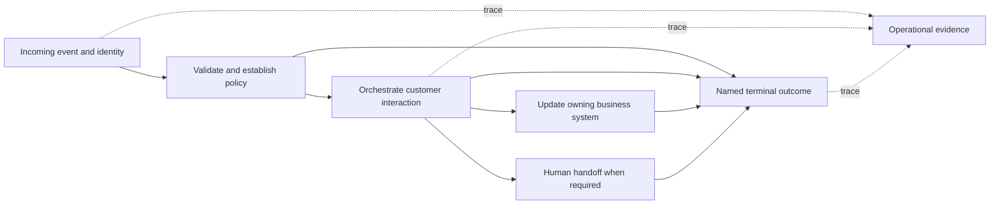

# Webex Connect platform and flow design

Evidence checked: **2026-09-08**. This chapter separates official platform behavior from **engineering recommendations**. Product documentation describes available capabilities; it does not establish that a particular tenant has the corresponding entitlement, asset, permission, or release.

## Identify the right product first

| Surface | What it builds | Recognizing the environment |
| --- | --- | --- |
| **Webex Connect Flow Builder** | Communication journeys across channels, business systems, APIs, and bots | Webex Connect portal, Services, a node palette, Working Draft, and Make Live |
| **Webex Contact Center Flow Designer** | Contact Center call handling and routing using activities/events | Control Hub → Contact Center → Customer Experience → Flows; activities, subflows, and global variables |

Connect is the CPaaS platform formerly named **imiconnect**. Its platform includes messaging APIs/SDKs/webhooks, a visual builder, channel templates, integrations, reporting, analytics, and debugging. Older `imiconnect` branding in official links does not automatically make a source irrelevant. [Webex Connect platform overview](https://help.webexconnect.io/docs/welcome).

Contact Center Flow Designer has its own activity model, provisioning dependencies, expression language, version labels, and flow-file procedures. Its documentation dated **2026-09-03** describes Control Hub access and call-routing dependencies such as entry points, queues, agents, and audio files. Do not apply its Pebble expressions, JSON flow-import instructions, or Dev/Test/Live version-label procedures to Connect flows without product-specific evidence. [Contact Center Flow Designer](https://help.webex.com/article/nhovcy4).

For Contact Center digital channels, Cisco explicitly describes creating channel assets in Connect, registering them with Contact Center, then building the digital-contact lifecycle in **Connect Flow Builder**. A project can therefore involve both products; identify which editor owns each part. [Set up digital channels in Webex Contact Center](https://help.webex.com/en-us/article/nmzsthj/Webex-Contact-Center).

The Connect documentation labels the separate **Voice Flow Builder** as deprecated. Treat tutorials showing its Compile/Publish controls as legacy-specific, and select the current voice workflow supported by the tenant. [Flows](https://help.webexconnect.io/docs/flows-introduction).

## Platform objects and ownership

| Object | Documented purpose | Design implication — engineering recommendation |
| --- | --- | --- |
| Tenant/client | Top-level platform account | Record tenant identity, region, release, owner, and enabled capabilities before configuration |
| Group and team | Organizational subdivisions controlling user/asset visibility | Confirm the active view when an expected asset is missing |
| Service | Named workspace for one communication use case or journey | Give each independently operated journey its own service |
| Flow | Executable communication logic | Give each flow a clearly defined trigger, terminal outcome, and owner |
| Channel asset | Number or app through which communication occurs | Map the exact production or test asset explicitly |
| Integration | Connection to a business system, bot, or contact platform | Separate configuration availability from successful authorization |

A service contains flows and rules and exposes service credentials for supported APIs and external triggers. Cisco recommends separate services for separate journeys to separate their configuration and statistics; the service guide states no upper bound on the number of services. [What's a Service](https://help.webexconnect.io/docs/service-introduction).

To create one: open the Connect home page, choose **Create New Service**, enter its name, and choose **CREATE**. The resulting service dashboard provides entry points for numbers, apps, APIs, rules, and flows. [Creating a Service](https://help.webexconnect.io/docs/create-a-service).

The service dashboard displays recent channel, flow, and messaging API activity for the previous **30 days**. It also provides the service key; Messaging API JWT tokens are under the service's Settings. [Inside a Service](https://help.webexconnect.io/docs/service-dashboard).

## Understand the workspace boundary

Documented hierarchy:

- Client-level users can switch into groups and teams; their permissions still depend on their role.
- Group-level users can access their group's assets and switch into teams within that group.
- Team-level users do not gain access to sibling teams or their parent group.
- A user is attached to one hierarchy level.

This hierarchy is not universal asset isolation. Templates, logbooks, media, customer profiles, contact policy, usage reports, and Smart Links have tenant-wide behavior. Custom integration sharing also has its own rules. Deleting a shared app from a group/team deletes it everywhere it is shared. Use the official asset matrix when choosing ownership or changing sharing. [Groups and Teams](https://help.webexconnect.io/docs/getting-started-groups-and-teams).

**Engineering recommendation:** treat a service, group, or team as a configuration and access boundary only to the extent the asset-specific documentation establishes. Do not promise independent test/prod isolation merely because two services have different names. Inventory shared resources before changing a template, logbook schema, contact-policy configuration, or app.

## Release and capability baseline

The local capture's default help/API documentation identifies itself as **6.20.0**, while the newest captured release announcement is **v6.22.0, September 2026**. Its rollout date is communicated separately. The announcement includes Control Hub WhatsApp/Messenger asset management, channel-specific CI authentication, WhatsApp template APIs and additional webhook fields. Treat these as announced changes whose availability needs tenant verification. [v6.22.0 release notes](https://help.webexconnect.io/changelog/product-update-v6220-september-2026).

The preceding **v6.21.0, August 2026** announcement adds Control Hub management for mobile/web and email assets and a selected-tenant CPaaS MCP beta for outbound non-templated SMS/email. Standalone Connect tenants without a valid Webex organization association cannot use Control Hub sign-in. The beta's messaging tools are not evidence of a Connect flow-authoring API. [v6.21.0 release notes](https://help.webexconnect.io/changelog/product-update-v6210-august-2026).

Pre-built integrations are enabled per account and are not all available by default. Inspect **Assets → Integrations**, filter by **Pre-built Integrations**, and check the selected integration's authorization and node versions. An existing integration entry alone is not proof that the authorization used by a particular node version is complete. [Pre-built integrations introduction](https://help.webexconnect.io/docs/pre-built-integrations-introduction).

The developer sandbox supplies preconfigured numbers/apps rather than allowing users to add their own. It is useful for bounded prototype exercises, but its assets and entitlements do not prove production readiness. [Accessing Webex Connect Sandbox](https://help.webexconnect.io/docs/accessing-sandbox).

## Translate the business journey into a build contract

The following is an **engineering design method**, not a platform-required form. Complete it before constructing the canvas. Unknown values become explicit prerequisites, not invented defaults.

| Decision | Write down | Example design choice |
| --- | --- | --- |
| Objective | One observable customer/business result | Appointment response recorded in the scheduling system |
| Entry | Trigger type, asset/event, filtering conditions, sample payload | Appointment event with request ID, destination, appointment ID, locale |
| Identity | Customer key, destination address, request/correlation key, conversation/thread key | One event ID per scheduling-system event; stable appointment ID |
| Input contract | Required/optional fields, types, encoding, missing-value handling | Reject missing appointment ID before sending a reminder |
| System of record | Which system owns each state transition | Scheduling system owns confirmed/cancelled status |
| Channel | Sender/app, recipient format, consent, permitted message/template, supported reply format | Approved template and approved test recipient |
| Timing | Delivery target, reply timeout, expiry, quiet hours, timezone | Stop acting on an expired appointment request |
| Branches | Success, invalid input, no response, integration failure, exhausted retry | No-response outcome distinct from cancelled outcome |
| Side effects | Each message, record update, task creation, callback | Repeating the input must not duplicate the booking update |
| Retry policy | Retryable conditions, delay, attempt bound, deduplication responsibility | Retry a transient lookup; reconcile ambiguous record updates |
| Handoff | Bot/human transfer condition and required context | Preserve request and conversation identifiers |
| Completion | Named business outcomes and external acknowledgement | Confirmed, cancelled, no response, rejected, technical failure |
| Evidence | Trace IDs, expected node paths, downstream observations | One test artifact per significant branch |
| Release | Environment bindings, operator, rollback version, monitoring interval | Candidate tested with designated test assets before production |

Do not use a delivery receipt as the definition of a business outcome. Sending a message, receiving a reply, updating a business record, and completing the journey are distinct observations in this design method.

## Design the flow graph

**Engineering recommendations:**

1. Start with the trigger and a table of expected terminal outcomes. Draw the shortest successful path, then add the actual failure, timeout, and invalid-input branches.
2. Validate and normalize input before expensive or irreversible side effects. Keep the original identifier available for support and reconciliation.
3. Use a node whose documented operation matches the task. Prefer visible branching and purpose-built nodes for simple decisions; use code only when data transformation or computation justifies it.
4. Give each integration an explicit contract: request fields, authentication source, acceptable responses, time budget, and failure ownership. Do not infer success from a connector reaching the next node.
5. Separate customer waiting time from backend request time. A customer reply timeout and an HTTP request timeout are different business events.
6. Make loops bounded. Design the retry exit and customer experience before adding the retry edge.
7. Keep environment-specific configuration out of repeated node literals where the platform provides a suitable configuration mechanism. Record which values are intentionally different at release.
8. Use pages for readability and reusable flows for genuinely reusable behavior. Neither choice removes the need to understand runtime execution limits or parameter contracts.
9. Record why a branch exists in a note, especially compensation, consent, expiry, and handoff behavior. Use labels that describe customer/business outcomes rather than only node mechanics.
10. Keep shared state transitions atomic in the system that owns them. A visual canvas alone is not proof of exactly-once processing.

Conceptual design map; arrows express design responsibilities, not an undocumented execution order:

## Operational prerequisites that belong in design

Cisco's tenant setup recommendations include timezone/date-format configuration, least-privilege roles, API IP allowlisting, restricted log-decryption rights, service locking, and channel consent/unsubscribe handling. Include these in the journey's dependency record rather than discovering them after launch. [Tenant Configuration Best Practices](https://help.webexconnect.io/docs/getting-started-best-practices).

**Engineering recommendation:** the completed design packet should contain the contract above, an asset/integration dependency list, a flow graph, a branch test matrix, and a release/rollback record. A builder should be able to identify both the next canvas action and its expected observable result without repeating architecture research.

Continue with [Flow lifecycle](02-flow-lifecycle.md) for creation and release, and [Testing and operations](07-testing-and-operations.md) for runtime evidence and operational settings.

## Limits of this chapter

No authenticated tenant was inspected for this chapter. Account-specific role rights, entitlements, quotas, asset bindings, feature rollout, and successful integration calls remain deployment facts to verify. Official current pages were accessed on **2026-09-08**; sources displaying only relative update ages are not assigned invented publication dates.
