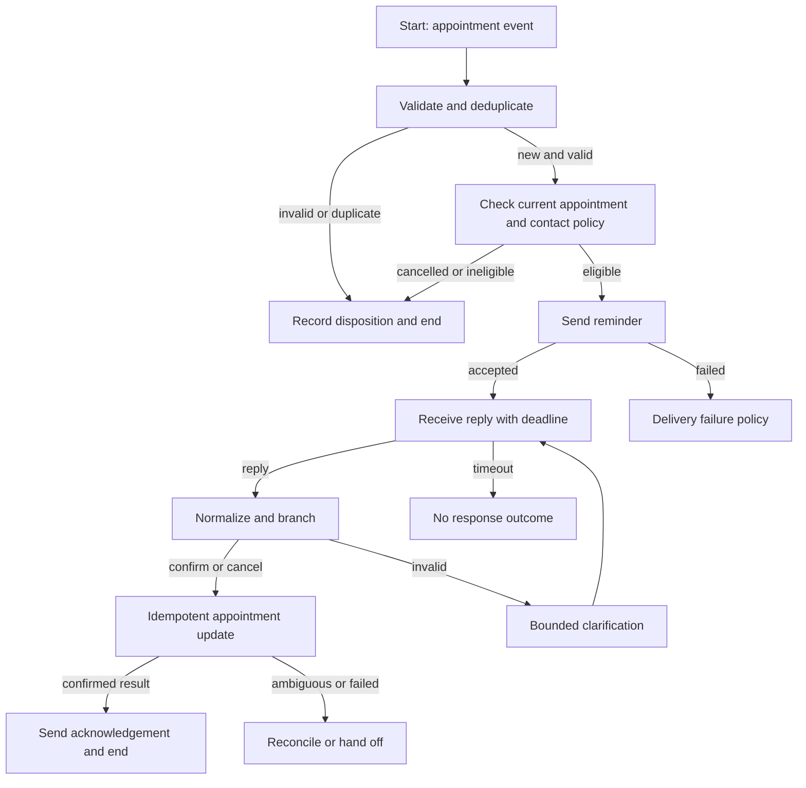

# Flow recipes and implementation patterns

These are **engineering designs**, not vendor-provided templates or importable
flow JSON. Product field names, variable scope and edge behavior come from the
[node reference](04-node-reference.md), [variables](03-variables-and-expressions.md),
[channels](05-channels.md), and [integration reference](06-integrations-and-contact-center.md).
Bind logical names below to the exact output-variable picker entries in the
target flow. The chapter links carry the primary-source citations.

Start each implementation with the [build brief](../templates/flow-build-brief.md).
Every recipe needs actual node-outcome wiring and executed tests; the diagrams
describe logical outcomes, which may differ from displayed product edge labels.

## 1. Appointment reminder with confirmation and cancellation

**Contract:** an authenticated upstream event supplies `eventId`,
`appointmentId`, `customerKey`, `destination`, `appointmentTime` (including zone),
and `locale`. The appointment system owns booking status. Use synthetic data
and a designated test recipient while building. A telephone number alone is
not sufficient to identify one of several simultaneous appointments.



| Step | Node(s) to configure | Concrete mapping or decision |
|---|---|---|
| Accept event | Start, Branch / Evaluate | Select the actual webhook/custom event; map the six required business fields into named custom variables; reject missing IDs and invalid destinations before sending. |
| Deduplicate | HTTP / approved datastore integration | Use `eventId` in a durable upstream operation record. Choose whether duplicates return prior status or simply terminate; do not rely solely on an active-session duplicate switch. |
| Recheck eligibility | HTTP, Branch | Fetch current appointment version/status and channel eligibility. A stale scheduled reminder must not revive a cancelled appointment. |
| Notify | channel send node | Bind correct asset/sender, recipient, localized approved content, and business context; separately track API acceptance and delivery events. |
| Await input | Receive | Configure the real channel/event, identity/correlation and timeout fields. Decide what happens when the same person has multiple pending reminders. |
| Interpret | Evaluate / Branch | Normalize permitted text or stable button payload; allow confirm/cancel, offer help, cap invalid attempts (for example two clarifications). |
| Write | HTTP / integration | Send appointment ID, desired status, event-derived idempotency key and expected version if supported; only acknowledge a verified result. |
| Finish | terminal edges, outcome/logbook configuration | Record `confirmed`, `cancelled`, `expired`, `ineligible`, `delivery_failed`, or `needs_review`; avoid recording a medical appointment's details in general logs. |

Logical sample payload (not a product API envelope):

```json
{
  "eventId": "reminder-demo-001",
  "appointmentId": "appt-demo-001",
  "customerKey": "customer-demo-001",
  "destination": "<authorized test destination>",
  "appointmentTime": "2026-10-20T10:00:00-05:00",
  "locale": "en-US"
}
```

Acceptance: one appointment update despite duplicate trigger/reply; timeout has
its own disposition; invalid replies terminate after the cap; two appointments
cannot be confused; acknowledgement follows confirmed business success; an
HTTP timeout after a possible commit reconciles before any retry.

## 2. Inbound self-service order status

**Path:** inbound Start → normalize intent → collect order identifier with
Receive → verify identity using the approved business process → HTTP lookup →
parse selected fields → send minimal status → optional further-help Receive →
end or human handoff.

Keep `customerKey`, `orderId`, `verificationState`, `attempts` and current reply
separate. A new reply must replace the current input before the next intent
evaluation. Do not expose order information just because a user knows a number.
Prefer structured payload IDs over display text for menu selections.

Treat not found, multiple matches, not authorized, dependency unavailable and
invalid schema as different outcomes. Bound both identifier retries and total
conversation duration. Test a successful lookup, someone else's order, malformed
response, stale input on the second loop, no response and agent escalation.

## 3. WhatsApp approved outbound notification to two-way conversation

**Path:** event → deduplicate → eligibility/template decision → WhatsApp send →
status handling → Receive interactive reply → stable-payload Branch → business
action / human assistance → terminal disposition.

Before binding fields, consult the [WhatsApp channel contract](05-channels.md):
recipient identity, approved template and parameters, session eligibility and
available interactive types are product/channel constraints. Do not substitute
free-form content when a template is required. Store an opaque customer identity
and the channel-specific addressing value separately.

Design content fallback before launch: rejected template, missing parameter,
unsupported interactive payload, expired reply window, opt-out and unavailable
human assistance. A different channel is allowed only when its contact policy,
address and business purpose permit it. Test every button payload, translated
template parameter order, template rejection and delayed reply.

## 4. Human handoff to Webex Contact Center

**Path:** active conversation → collect reason and minimal context → choose
entry point/routing attributes → create/reuse conversation according to the
tenant integration → create task → queue/routing operation → relay events and
messages → close task/conversation on the correct lifecycle event.

Use the integration's actual channel-specific identity fields and lifecycle;
consult [contact-center handoff](06-integrations-and-contact-center.md). Keep
conversation ID, task ID, customer ID, entry-point ID and flow transaction ID in
distinct variables. Do not assume one generic ID works for every node.

Assign ownership of conversation closure, bot pause/resume and agent messages.
If queuing times out, first discover whether the task exists before creating a
second task. Define out-of-hours, queue-full, agent-unavailable and customer-left
paths. Test one active task per intended interaction, preserved transcript/context,
no bot reply while the agent owns the interaction, and clean terminal closure.

## 5. External API call with bounded recovery

**Path:** assemble validated input → HTTP/integration → inspect transport outcome
and business result → success, permanent failure, transient failure, or ambiguous
write → bounded delay/retry or reconciliation → terminal disposition.

| Failure class | Suggested engineering response |
|---|---|
| Malformed input / authentication / authorization | Route for correction; retrying identical input normally adds load without progress. |
| Throttling / temporary unavailability | Honor the dependency's contract and retry hint; cap attempts, total elapsed time and concurrency; spread deferred work when feasible. |
| Connection failed before a confirmed request | Apply the operation's retry policy; record reason and attempt number. |
| Request timeout after a possible write | Query status by business/idempotency key, or route to reconciliation. A timeout does not prove no write occurred. |
| Success HTTP status but rejected business payload | Follow business failure handling, not a generic success edge. |
| Unexpected or incomplete response schema | Use explicit fallback; never manufacture missing values. |

Initialize `attempt=0`, `maxAttempts`, `deadline`, `operationKey`, and a terminal
error reason. Increment exactly once per actual attempt. A chosen schedule such
as 1, 2, 4 seconds is exponential; 60, 120, 180 seconds is linear. Neither schedule
is universally appropriate. Idempotency must be supported by the business
system, not inferred from an HTTP method or invented request header.

## 6. Business-hours routing and scheduled reminders

**Path:** incoming/scheduled event → validate freshness → determine applicable
time zone/calendar → open-hours decision → immediate action or defer/alternate
message → revalidate eligibility when resumed → send or terminate.

Use the documented Social Hour and scheduler capabilities in the node/reference
cache. Agree whether policy follows customer, branch, service or tenant time;
include weekends, holidays and daylight-saving transitions. For appointments,
recheck the current record after a delay. Put a freshness limit on reminders so
an outage does not cause obsolete notifications to be sent in a burst.

Test just before/at/after a boundary, DST gap/repeated hour, holiday, rescheduled
appointment and a backlog release. Queueing or rate control belongs in the
system that actually owns concurrency; a long Delay is not a general queue.

## 7. Channel fallback with one business notification

**Path:** eligible preferred channel → send → definitive failure or business
deadline → recheck whether already delivered → eligible alternate channel →
terminal result. Track every channel attempt under one `notificationId`.

Decide whether the business values speed or avoiding duplicate customer contact
when delivery is uncertain. Delivery callbacks can arrive after a fallback has
started. A durable send-state record prevents parallel workers from each sending
the same fallback. Keep business completion independent of transport acceptance.

Test late delivery, duplicate callbacks, out-of-order status, unavailable alternate
address, contact-policy rejection and retries from two workers. Do not treat
all non-delivery as grounds for an alternate-channel send.

## 8. OTP verification as a reusable capability

**Path:** validate purpose/customer → enforce business rate policy → generate OTP
using the documented node → deliver → Receive candidate → Validate OTP → success,
retry subject to attempt budget, expiry or failure → return defined result.

Keep challenge identity, purpose, expiry and verification result in an explicit
contract. Bind channel destination to the intended authenticated business action.
Never log the OTP. Failed delivery is not failed verification. Decide what a
resend does to older challenges according to actual product/service behavior.

Reuse within a flow or across flows only using the documented modularization
mechanism; explicitly map inputs and output result. Do not assume ordinary
function-call return semantics. Test wrong, expired, reused and superseded OTPs,
resend race, too many attempts and a changed destination.

## 9. Bot intent and entity collection with API fulfillment

**Path:** Start/Receive latest input → bot integration → evaluate completion and
intent → prompt for missing entities or validate completed values → invoke
business API → compose factual result → Receive next input / handoff / end.

Store latest user message, bot session identity, intent, entities and fulfillment
status separately. Validate dates/IDs/permissions before a side effect. A bot's
proposed answer is not evidence that a booking or refund succeeded. Only the
business system can confirm fulfillment. Parse rich responses according to their
actual schema instead of pasting JSON into a plain-text message field.

Test incomplete slots, user correction, intent change, unsupported language,
multiple turns, duplicated fulfillment event, integration error and escalation.
Provide a bounded fallback for repeated misunderstanding.

## 10. Voice IVR with digital follow-up

**Path:** documented Connect voice start/call operation → Play / IVR Menu or
Collect Input → route valid selection → HTTP business lookup or Call Patch →
capture call disposition → eligible digital follow-up → end.

Use the [voice reference](05-channels.md) and cached node pages for actual prompt,
DTMF, speech, retries and timeout controls. Webex Contact Center's separate voice
Flow Designer uses different activities and cannot be configured from this plan.
Design silence, invalid digits, busy, no answer, disconnect during lookup and
patch failure explicitly. Confirm a usable digital address and permission before
follow-up; caller ID alone does not establish the full business contract.

## 11. Event fan-out, bulk work and long-running business processes

Use an upstream work ledger and queue when each customer needs a separate
deduplication record, schedule, retry policy and audit trail. Trigger one bounded
interaction per appropriate business unit of work. Keep a correlation key when
later events resume or supersede the process.

Evaluate documented Event Scheduler, inbound event and batch API capabilities;
do not assume every API batch item creates an independent flow session. Test a
partial batch failure and a repeated source-file/event import. Record per-item
result so one failed recipient does not erase successes or cause full-batch
replays. Decouple long business waiting periods from short synchronous API calls.

## 12. Reusable subflows and migration

Choose a stable capability such as identity verification, eligibility lookup or
handoff. Define required inputs, produced outputs, terminal states, side effects,
timeouts and errors before moving nodes. Give the parent a clear rule for where
execution proceeds afterward, backed by the actual node configuration.

For each caller, test variable visibility and mutation, nested invocation if used,
and dependency version selection. On export/import, inventory assets, integrations,
authorization bindings, templates, service-dependent references and limits. A
file that imports successfully is not proof that its recipient assets or runtime
dependencies are valid. Follow [lifecycle](02-flow-lifecycle.md) and
[operations](07-testing-and-operations.md) for validation and publication.
