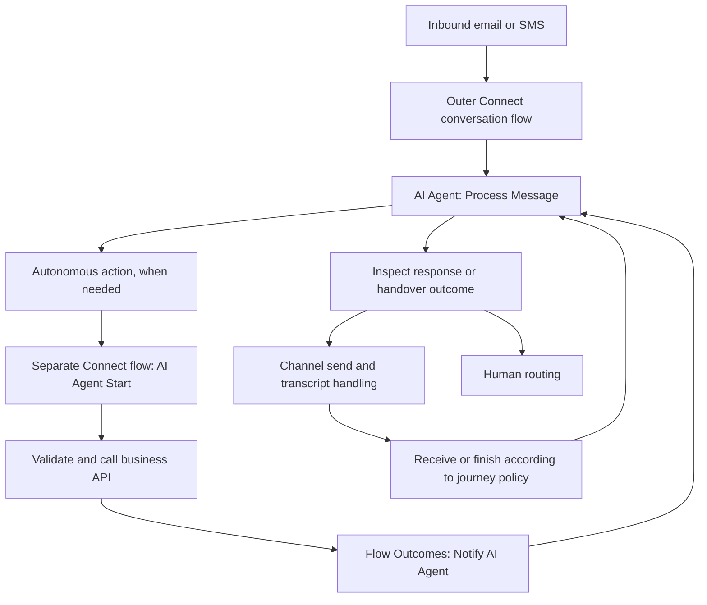

# AI Agent flows: the primary build reference

Use this chapter to design the agent and its Connect orchestration together. Continue with [email and SMS recipes](14-agent-email-sms-recipes.md) for channel wiring. This is a reference and build specification, not a record of a deployed or tested agent.

Evidence was retrieved on **2026-09-08**. Connect help captures identify documentation version **6.20.0**; the Studio administration guide was modified **2026-09-08** and supplies no semantic version. These are separate from a tenant's node version. Exact source bodies, tables, and metadata are available locally below. Recommendations and illustrative business contracts are explicitly marked; they are not vendor import schemas.

## 1. Choose the orchestration pattern

**Recommended design decision:** pick the smallest pattern that satisfies the customer task before choosing nodes. Agent reasoning, delivery, and backend transactions have different completion conditions.

| Pattern | Good starting use | Own the behavior here |
| --- | --- | --- |
| Autonomous agent with knowledge | Policy questions with natural follow-up | Agent instructions and curated knowledge; Connect owns message delivery and escalation |
| Autonomous agent with actions | Look up an order, check availability, perform an authorized change | Agent collects action inputs; a short fulfillment flow validates and calls the system of record |
| Scripted agent | Explicit intent/slot progression and controlled responses | Studio scripts; outer Connect flow performs response-triggered digital fulfillment |
| Existing Task Bot / QnA Bot | Maintenance of an existing legacy integration | Preserve its own node contract; translate deliberately when migrating |

The **AI Agent node** invokes Studio agents. An **AI Agent Start trigger** receives an action's fulfillment request. They face opposite directions. The scripted digital fulfillment procedure uses the outer conversation flow; see sections 4–5. Do not identify a flow's purpose from the words “AI Agent” alone.



This diagram is an engineering model of the two documented integration directions; actual nodes/outcomes depend on the selected versions. The arrow through fulfillment does not imply a manually drawn edge from Process Message into the fulfillment flow.

## 2. Current AI Agent node contract

[AI Agent node documentation](https://help.webexconnect.io/docs/ai-agent-node), [full local reference](../sources/cache/help/ai-agent-node.md). Obtain qualified variable names from the picker.

| Field/output | Meaning |
| --- | --- |
| Process Message | Agent type, Agent, Message, Language, Channel, channel-specific user identifier |
| Custom Parameters | Persistent customer-profile key/value data; response expression `${consumerData.extra_params.<key>}` |
| Message Parameters | Next-response-only data; `${extra_params.<key>}` |
| TextResponse | Text-only; first item if multiple |
| FullResponse | Array including multiple/rich messages |
| Datastore | User-defined agent session variables |
| TransactionId / SessionId / ConsumerId | Request / agent session / customer identifiers |
| MessageMetadata / SessionMetadata | Response / session metadata |
| ResponsePayload | Complete response |
| Close Session | Agent + Session ID from Process Message |

Documented outcomes: `onSuccess`, `onAgentHandover`, `onError`, `onInvalidCustomerID`, `onInvalidMessage`, `onTimeOut`. Documentation describes a **15-second** response timeout with ambiguous wording (“not more than”); do not infer its precise boundary. Default rate: **240 transactions/minute/tenant**, increase through account manager. Agent access controls visibility; Language is disabled for single-language agents. The page inconsistently names **Custom/Customer Parameters**.

**Tenant evidence, separate from documentation:** the parent's limited 2026-09-08 inspection of an unconfigured **b1.4** node showed `onInvalidData`, `onError`, `onInvalidChoice`, `onTimeout`, `onFailure`, `onAgentHandover`, `onSuccess`; fields included **UNIQUE ID** and **Customer Parameters**. No selected agent or execution established semantics. Reconcile the actual configured node's edges before authoring a flow; do not substitute the documented spellings blindly. This is not proof that every tenant/version exposes these edges.

### Suggested email/SMS field assignment worksheet

These are implementation choices, not additional platform fields. Names such as `customerMessage` are proposed custom variables, not built-ins.

| Catalog field | SMS assignment | Email assignment |
| --- | --- | --- |
| Agent type / Agent | Selected reviewed agent | Selected reviewed agent |
| Message | Normalized current inbound text | Current authored email text; remove quoted history according to an explicit policy |
| Channel | SMS | Email |
| User identifier | Current channel's sender identity | Current channel's sender identity |
| Language | Supported customer-language choice | Supported customer-language choice |
| Customer/profile parameters | Durable, verified preferences only | Durable, verified preferences only |
| Message parameters | This request's trusted context | This thread/request's trusted context |

Do not put a flow transaction ID into the customer identifier to “fix” session collisions without evidence: that changes the identity model. Do not treat a phone number or email address as proof of account authorization. The public Process Message contract does not expose an input Session ID or specify isolation of simultaneous email threads belonging to one customer. Record this as a tenant-specific question if the design needs concurrent isolated agent sessions.

## 3. Configure the Studio agent and knowledge

The current [Studio administration guide](https://help.webex.com/article/ncs9r37) documents these configuration surfaces. Its [complete local copy](../sources/cache/studio/article--ncs9r37.md) includes all seven chapters and their field tables.

| Studio reference | Essential contract |
| --- | --- |
| [Actions](../sources/cache/studio/article--ncs9r37.md#concept-template_5ea99e1f-a679-4cf9-8e33-7a4f83d9f66a) | Fulfillment, Transfer, or available MCP actions |
| [Slots](../sources/cache/studio/article--ncs9r37.md#concept-template_0ec5103d-ff6f-426f-a28c-bb335bc7b1bb) | Entity name/type/description/examples/Required; name ≤256, description ≤512 characters |
| [JSON editor](../sources/cache/studio/article--ncs9r37.md#concept-template_7d93102d-6315-44a3-a257-9c211827de36) | Object schema with properties/required; only type validation is enforced |
| [Knowledge](../sources/cache/studio/article--ncs9r37.md#create-knowledge-source-for-ai-agent) | Files, articles, websites; exclude sensitive personal/payment/health information |
| [Bind knowledge](../sources/cache/studio/article--ncs9r37.md#task-template_9b7eb61b-facf-4467-902b-53276bd3723d) | Configurations → Knowledge; select, save, publish |
| [MCP](../sources/cache/studio/article--ncs9r37.md#concept-template_9483e1f4-c3e2-4080-b9d3-5359b553a785) | Developer registration + Control Hub authorization; OAuth2 client credentials/API key/custom header; settings read-only in Studio |

Action names permit 64 characters, descriptions 1024. The guide's general ten-action limit coexists with an organization-configured MCP limit; verify capacity locally. Transcript permissions are separate. Preview, publication, Sessions, and version history are separate surfaces. Autonomous agents use goals/knowledge/actions; scripted agents use predefined scripts.

**Access:** Connect's **App Tray → Webex AI Agent Studio** is documented. If absent, check entitlement/access and the documented feature-enablement path rather than assuming a broken flow. The older Connect guide's Control Hub Quick Links path can differ from current navigation. [Getting started](https://help.webexconnect.io/docs/getting-started-with-webex-ai-agent-studio), [local copy](../sources/cache/help/getting-started-with-webex-ai-agent-studio.md). Sandbox documentation limits creation to **five agents of each type**, with support handling increases; this is not the production limit. [Sandbox](https://help.webexconnect.io/docs/webex-ai-agent-in-sandbox).

**Engine selection:** the September 2026 engine guide lists autonomous Pro 2.0, Pro-US 2.0, and Pro-Europe 2.0; regional variants are English-only and region-restricted. The corresponding 1.0 engines are marked for future deprecation, without a firm date. Scripted Pro 2.0 with Swiftmatch requires at least ten representative utterances per intent and a clear intent description. Select against the agent's actual engine/language availability. [AI engines](https://help.webex.com/article/ne6s80cb), [local details](../sources/cache/studio/article--ne6s80cb.md), [language matrix](../sources/cache/studio/article--pdef2d.md).

### Recommended knowledge preparation

Prepare knowledge as answerable business material, not a dump of everything an operator can access:

1. Define questions in scope and the source that can authorize each answer. Keep volatile account/order facts in backend lookups; keep stable policies in knowledge.
2. Give each source an owner, effective date, applicable geography/product, and replacement rule. Resolve contradictory prices, deadlines, or policies before ingestion.
3. Make each section intelligible alone. Replace “see above” with the actual subject. Give table columns explicit names and units; avoid merged cells that obscure which value belongs to which item.
4. Include exceptions and the safe next step when the answer is unavailable. Do not convert an omission into an invented policy.
5. Design a small answer set with source-supported expected facts, near-miss questions, conflicting requests, and questions requiring escalation. Add new cases when real failures reveal a gap.
6. Record which content revision was reviewed and attached to which agent version. A file existing locally does not prove it was ingested, approved, bound, or published.

For exact upload constraints and operations, open the cached guide at [upload rules](../sources/cache/studio/article--ncs9r37.md#upload-files), [website extraction](../sources/cache/studio/article--ncs9r37.md#extract-website), and [review/synchronization](../sources/cache/studio/article--ncs9r37.md#approve-content-after-review). Consult these local tables instead of guessing file limits or crawling semantics.

### Recommended instruction specification

Cisco's [automation guidelines](https://help.webex.com/article/nelkmxk) recommend a concise purpose-level goal, simple non-conflicting actions, accurate slot descriptions, and deterministic business logic in Connect. Its [local prompt guide](../sources/cache/studio/article--nelkmxk.md#concept-template_1e9f7013-9140-4ee6-8e4b-107b1057f819) supplies an instruction template covering identity, context, tasks, response guidance, and fallback. It also distinguishes knowledge lookup from analytical/SQL-style processing of tables; route calculations or aggregate queries to an appropriate backend action.

Write an agent brief containing: purpose; authorized tasks; authoritative knowledge; available actions and when to call them; facts the agent must collect; how to handle missing/ambiguous information; what constitutes success; escalation conditions; and channel-appropriate response style.

An illustrative order-support brief:

> Help customers understand delivery policy and the current status of their orders. Use the policy knowledge for general questions and the order lookup action for a specific order. Ask for missing required information without guessing it. Describe a change as complete only after the backend confirms it. If verification fails, the result is uncertain, or the customer requests a person, explain the next step and use the configured escalation path. Keep SMS replies short; use readable paragraphs for email.

This is an original design example. Review the business authorization rules outside the language model: instructions alone should not decide whether a customer may read or modify a record.

## 4. Autonomous action fulfillment: exact Connect setup

[Official fulfillment procedure](https://help.webexconnect.io/docs/configure-fulfilment-flows-for-ai-agent-actions), [complete local copy](../sources/cache/help/configure-fulfilment-flows-for-ai-agent-actions.md):

1. Use **AI Agent** Start in a client-workspace service. Event: **Trigger from AI Agent to initiate flow**; endpoint authentication: Webex CI.
2. **Provide sample JSON → Parse** exposes input entities. Match the Studio action's slot payload; add trigger conditions if needed.
3. Execution maximum: **30 seconds**. **Delay, Social Hour, Receive, Call Workflow** are restricted here.
4. Configure **Flow Settings → Flow Outcomes → Last Execution Status → Notify AI Agent**. Notification defaults on. Use key/value or pasted JSON, including nested structures/arrays; maximum **16000 characters**.
5. Last Execution Status uses the final node event without manual End-event mapping. Latest assigned values form the return payload. Disabling notification prevents a fulfillment response; changing Start disables it and deletes its configured Start payload.
6. Publication: **Make Live**. Studio: **Actions → action → Webex Connect Flow Builder Fulfillment → service → flow**; client-workspace resources only.

This mechanism documents the return path; it does not require a dedicated “Return Response” node. No universal “Execute Flow” action schema is established by these sources.

### Recommended action contract

Write the contract before wiring the HTTP node. Keep display text separate from machine decisions.

| Contract part | Example for `lookup_order` |
| --- | --- |
| Purpose | Retrieve one authorized customer's order status |
| Inputs | Order reference; trusted account context supplied by the application |
| Validation | Required values, syntax, allowed values, customer-to-record authorization |
| API behavior | Method/path/authentication, success schema, not-found and temporary-error behavior |
| Business result | FOUND, NOT_FOUND, NOT_AUTHORIZED, TEMPORARY_FAILURE |
| Retry rule | Reads may retry within budget; writes require a duplicate-prevention contract |
| Evidence | Correlation identifiers and sanitized result classification |

An illustrative **user-defined input schema**, suitable as a design starting point for the documented JSON entity editor, is:

```json
{
  "type": "object",
  "properties": {
    "orderReference": {
      "type": "string",
      "description": "The order reference provided by the customer."
    }
  },
  "required": ["orderReference"]
}
```

The corresponding **sample business payload** is `{"orderReference":"EXAMPLE-123"}`. Neither object is a complete Connect flow export or a guaranteed platform envelope. Do not copy an entity schema into the sample payload field. Validate optional values, allowed formats, authorization, and business rules explicitly in the backend.

A suggested custom return body is:

```json
{
  "outcome": "FOUND",
  "orderStatus": "IN_TRANSIT",
  "estimatedDelivery": "2026-09-12",
  "reference": "example-correlation-value"
}
```

These keys/statuses are **our proposed business contract**, not Cisco status fields. Define separate bodies for not-found, denied, and temporary failure. Keep internal tokens, raw exception text, and unnecessary customer records out of the agent-facing result. Map every terminating branch to a meaningful result; a technically completed flow is not necessarily a successful business operation.

If work takes longer than the action budget, redesign the business operation as a short submission/status lookup and continue the customer journey outside the fulfillment flow. Do not silently convert a timeout into success or retry a non-idempotent write whose outcome is unknown. See [HTTP and parsing](04-node-reference.md) and [operational failure design](07-testing-and-operations.md).

## 5. Current scripted digital fulfillment

The official [scripted fulfillment guide](https://help.webex.com/article/mzpuseb#digital-channels) (June 2025; [local copy](../sources/cache/studio/article--mzpuseb.md#digital-channels)) uses this sequence:

1. Configure a holding response for the response requiring backend work.
2. Parse **SessionMetadata** from the AI Agent response. Obtain a sample from **Studio Sessions → transaction → download transaction info → `generatedDf`**.
3. The documented paths are `$.model_state.template_key` for response name and `$.previous_intent_model_state.intent.name` for previous intent.
4. Branch on the response name. Call the API, parse its result, and compose the fulfillment reply with Evaluate.
5. Send the reply, append it to the conversation, and return to Receive for the next turn.
6. For intent-based human routing, branch on previous intent before Queue Task.

These paths belong to the documented scripted metadata example. They do not establish an autonomous metadata schema or a `TemplateKey` output on the current AI Agent node. Inspect representative metadata when changing agent/node versions.

### Scripted intent and state reference

[Intents/entities/responses](https://help.webex.com/article/sz02k8), [full local catalog](../sources/cache/studio/article--sz02k8.md): intents represent tasks; entities hold extracted values. Entry contexts must be included in active session contexts; exit contexts activate when an intent completes. Fallback has no slots and uses its default response key. **Talk to an agent** requests handover regardless of changing its response key. Custom entity types include list, regex, digits, alphanumeric, free form, and WhatsApp location. Response variables include `entity.<entity-name>` and `lastdfState.model_state.entities.<entity-name>.value`. Common response-variable and channel-support tables are preserved locally; agent-response expressions are not Connect variable syntax.

**Recommended script design:** one intent per meaningful user task; distinguish close intents with realistic contrasting utterances. Name final response keys so the outer flow can recognize business completion. Give slot collection a repair prompt, a cancellation route, and a maximum failed-attempt policy. Handle fallback and “person please” from every relevant state. Preserve the last business intent separately from the handover request if routing depends on it.

## 6. Sessions, replies, and human ownership

**Recommended orchestration worksheet:** identify each row independently; do not substitute one ID for another because both look unique.

| Identity/state | What the flow must decide |
| --- | --- |
| Channel customer | Which sender is this, on which asset/channel? |
| Channel message/thread | Is this a duplicate event, a new turn, or a different thread? |
| Connect transaction | Which invocation/continuation produced this transition? |
| AI consumer/session/request | Which agent conversation and inference call produced this reply? |
| Contact Center conversation/task | Who owns the conversation now; does a human task already exist? |
| Business operation | Has this lookup/write already completed, failed, or become uncertain? |

The channel and contact-center contracts are in [channels](05-channels.md), [integration lifecycle](06-integrations-and-contact-center.md), and [email/SMS agent recipes](14-agent-email-sms-recipes.md). The identity/correlation implementation must be consistent across the initial trigger, Receive continuation, transcript append, and human handoff.

Recommended control flow:

1. Normalize and classify the inbound event. Handle receipt/system events separately from customer text. Reject or explain unsupported attachments rather than pretending they were read.
2. Check current conversation ownership. If a human owns the task, append/route the message through that path; prevent simultaneous automated replies.
3. Invoke the selected agent with the current message and necessary trusted context.
4. Handle handover and failure edges explicitly. On normal response, validate the representation and map it into a channel-supported reply.
5. Preserve all intended response items. Do not assume a first-text shortcut contains a whole answer; define how rich/multiple items become ordered SMS messages or an email body.
6. Record the outgoing/incoming conversation as required by the selected integration. Sending, receiving a provider receipt, and appending a transcript are separate operations.
7. Wait/continue or end according to the journey's session policy. A close operation must target the right agent session; a closed flow, conversation, task, and AI session are distinct states. Before closing, establish that no other pending turn relies on the same session; one completed email should not unconditionally terminate shared conversational state.

For email, explicitly decide whether one agent turn drafts a complete answer or the journey continues across replies. For SMS, decide inactivity handling and the treatment of a late reply. Neither decision can be settled by assuming that an AI session ID is also a mail thread ID.

## 7. Failures, observation, and review cases

**Recommended failure policy:** record the failing boundary first. Separate invalid inbound data, unavailable agent, missing/empty response, timeout, fulfillment validation error, business denial, backend ambiguity, delivery failure, and human-routing failure. Give each a bounded recovery or customer-visible next step.

Keep the documented inference timeout, short fulfillment execution limit, outer Receive timeout, HTTP timeout, and channel/session lifetimes as **different budgets**. Their ordering is not proven merely by their numeric values. Do not add them together or promise that an action can always use the whole fulfillment limit during one agent request.

Recommended review cases, to execute only when a later task authorizes execution:

| Case | Expected evidence |
| --- | --- |
| Supported knowledge question | Answer contains expected supported facts; no invented policy |
| Missing action input | Agent requests the missing value; no premature backend change |
| Invalid/unauthorized input | Backend rejects it; reply avoids exposing another record |
| Backend not found / unavailable | Distinct controlled result; no false success |
| Duplicate request / uncertain write | Defined duplicate-prevention or reconciliation behavior |
| Two turns / changed intent | Correct current context and requested task |
| Concurrent threads for same customer | Demonstrated intended isolation or documented restriction |
| Explicit human request | Human-routing path owns subsequent messages |
| Multiple/rich response items | Complete channel-appropriate output in intended order |
| Timeout then late reply | Defined session reopening/continuation behavior |
| Delivery or transcript failure | Visible recovery state; no silent assumption of delivery |

For observability, correlate the AI request/session with the flow transaction, business request, delivery identifier, and human task. Log compact classifications and approved metadata. Inspect platform sessions when a response or metadata shape is unexpected; do not infer it from a tutorial screenshot. Cached navigation: [autonomous session details](../sources/cache/studio/article--ncs9r37.md#section_cwz_lk3_f2c), [scripted sessions](../sources/cache/studio/article--ncs9r37.md#section_w2r_bvw_1dc), [scripted tests](../sources/cache/studio/article--ncs9r37.md#concept-template_a2c9cfa0-3c80-42fb-8dca-ae3a25dd78c9). Review flows using [the operations checklist](07-testing-and-operations.md).

## 8. Templates, legacy nodes, and voice boundaries

Official [AI agent templates](https://help.webex.com/article/n8mo4c) include autonomous **Track Package** and **Doctor's Appointment**. The latter demonstrates availability, creation, lookup, and cancellation actions; its optional confirmation-SMS action starts disabled and needs a number asset. Templates link separate Connect fulfillment flows and example knowledge. They are learning examples requiring adaptation, not evidence that a tenant has those resources or that sample services are suitable for production. [Local template guide](../sources/cache/studio/article--n8mo4c.md) preserves the official sample links. A Studio agent template, Connect flow template, and backend API example are different artifacts.

For the three documented Connect templates' node relationships, sample-specific bindings, and timeout scope, read [the connected sample walkthroughs](15-sample-flow-walkthroughs.md#the-three-named-ai-agent-templates).

| Legacy node | Contract to preserve during migration |
| --- | --- |
| [Task Bot](https://help.webexconnect.io/docs/task-bot-node) | Intent/Entities/TemplateKey/PotentialIntents and legacy reply fields are documented; [local catalog](../sources/cache/help/task-bot-node.md) |
| [QnA Bot](https://help.webexconnect.io/docs/qa-bot-node) | Article/PotentialArticles/CategoryName and legacy reply fields are documented; [local catalog](../sources/cache/help/qa-bot-node.md) |

The page titled [Configuring flows with AI Agent Node – WXCC](https://help.webexconnect.io/docs/configuring-flows-with-ai-agent-node) actually demonstrates Task Bot/QnA Bot and `taskbot.entities`/`bot.text_response`. Treat its loop/handoff story as legacy evidence. Do not copy those output names into the current AI Agent node.

Voice examples use Contact Center's **Virtual Agent V2** activity and its state-event/metadata contract. [Custom events](https://help.webex.com/article/n5uo60x) are documented for scripted **voice**, not a generic digital callback protocol. [Multi-agent orchestration](https://help.webex.com/article/5a07xcb) describes transfer through Virtual Agent V2's escalated path, including announced/silent transfer choices. It does not establish the same mechanism for Connect email/SMS. [Deployment reference](https://help.webex.com/article/s0qro1) separates voice and digital procedures. Read [product boundaries](01-platform-and-design.md) before borrowing a voice-flow expression or activity.

## 9. Implementation handoff template

For a future authorized build, produce one concrete specification containing:

- Agent purpose/type/engine/version and exact channel scope.
- Reviewed instructions, knowledge ownership/revision, action input/output contracts.
- Node versions, actual picker variable names, all outcome edges, and channel field mappings.
- Identity, threading, duplicate handling, session closure, and human ownership policy.
- Backend authentication source, validation, business authorization, idempotency, and timeout behavior.
- Reply conversion and transcript/delivery handling.
- Expected review cases, evidence locations, deployment ownership, and rollback/version plan.

This specification should identify every tenant-specific unknown explicitly. Most routine product lookup is already captured here and in the linked local source tables; only unresolved tenant/version behavior or changed external contracts should require fresh investigation.
