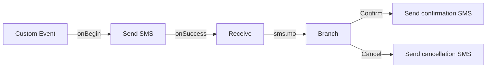

# Sample flows as connected systems

Read this alongside the [AI Agent playbook](13-ai-agent-flows.md) and [email/SMS recipes](14-agent-email-sms-recipes.md). A useful sample review explains how one node's output becomes another node's input, which event chooses the next edge, what survives a loop, and what proves completion. A list of available nodes does not establish those relationships.

This chapter separates **documented sequence**, **visually observed diagram**, **downloaded native artifact**, and **engineering interpretation**. Public-source inspection performed 2026-09-08 did not execute, import, publish, or send anything. Unless specified, arrows below summarize published logic; they are not extracted native edge records. Node numbers are included only where the source supplies them.

## The three named AI Agent templates

**Documented sequence and bindings:**

| Sample | Connected behavior |
| --- | --- |
| **AI Agent Livechat Generic** | Livechat → pre-chat → resolve conversation → AI Agent → send response → append → Receive → append new message → AI Agent. Receive timeout (120 seconds) closes both conversation and AI session. Handover → Queue Task. |
| **AI Agent Scripted Doctor Appointment** | Extends that loop: after appending the agent reply, parse session response name → Branch → parse entities → matching HTTP lookup/booking/fetch/cancel → Evaluate shared reply variable → send/append → Receive. Unmatched response names go directly to Receive. |
| **AI Agent Fulfilment Track Package** | AI Agent action supplies package number → HTTP retrieves status → Flow Outcomes returns selected fields/JSON to the agent. This is the backend fulfillment segment. |

Published bindings: pre-chat Send `36`, Receive `38`, subsequent Append `1254`, Resolve `1590`, AI nodes `1695/1711`, Queue Task `1388`; configure `liveChatDomain`. These IDs belong to the published templates, not every imported copy. The guide supplies no exact HTTP-node IDs, backend request mapping, or complete edge labels. [Official digital template guide](https://help.webexconnect.io/docs/using-ai-agent-flow-templates).

**Engineering interpretation:** the Generic flow owns transport and conversation lifecycle. The scripted Doctor flow adds business fulfillment *inside* that lifecycle. Track Package is the separate action implementation called by an autonomous agent. A fulfillment result returns to the agent; it does not itself prove that a subsequent customer message was sent. An incoming customer reply belongs to the conversational loop, not to a long-lived invocation of the backend fulfillment flow.

To adapt this architecture for SMS/email, carry across the relationship between conversation/session identity, each incoming message, the agent turn, fulfillment, and reply. Replace the channel's actual identity, send, receive, and thread contracts using chapter 14. Reusing a Livechat pre-chat form or its conversation identifiers unchanged is not an SMS/email adapter.

## Public native doctor-clinic artifacts: acquisition and supported import review

The official Studio template guide links a public **doctor-clinic-fulfilment-flows** directory. Its artifacts were downloaded through GitHub's published file URLs; each file's URL, Git blob ID, byte count, retrieval time, and SHA-256 are recorded in [the manifest](../evidence/sample-flows/public-native-manifest.json). [Published sample directory](https://github.com/WebexSamples/webex-contact-center-api-samples/tree/main/ai-agent-fulfilment-flows/doctor-clinic-fulfilment-flows).

| Artifact | Acquired bytes | Static inspection result |
| --- | ---: | --- |
| `check_availability.workflow` | 28,160 | Hex text encoding opaque binary. |
| `create_appointment.workflow` | 29,696 | Same representation. |
| `lookup_appointment.workflow` | 27,648 | Same representation. |
| `cancel_appointment.workflow` | 28,160 | Same representation. |
| `sendSMS.workflow` | 29,184 | Same representation. |

**Static artifact evidence:** JSON parsing could not recover their graphs. Subsequent supported UI import into disposable Connect samples established their loaded canvas graphs; see the [full observed sample walkthroughs](../evidence/tenant-samples.md) and [sample inventory](../evidence/sample-flows/sample-inventory.json). The original static-inspection result remains in provenance. Their filenames are not proof of node types, payload fields, success edges, or error handling. Raw vendor artifacts remain ignored under `evidence/sample-flows/raw/`; no private tenant export or credentials were acquired. These are Connect fulfillment artifacts linked from the AI Agent documentation, not Contact Center voice Flow Designer graphs.

**Reusable review method:** in a permitted temporary viewer/import, trace each artifact from Start to its external side effect and Flow Outcome. For availability/lookup, inspect the argument-to-query mapping and no-result outcome. For create/cancel, inspect the record identifier, confirmation checks, and ambiguous-timeout behavior. For SMS, inspect destination, asset, message source, receipt wait, and whether the return means acceptance or delivery. Record node IDs and outcome labels before declaring any of those relationships observed.

## EPIC fulfillment examples: published node relationships

These are separate healthcare-integration templates, not proof that the public doctor-clinic demo uses EPIC. Their pages describe node order and contracts but do not provide downloadable graph records. The following walkthroughs preserve those distinctions and omit authentication secrets and sample personal data.

### Patient Match

**Documented sequence:** AI Agent input → EPIC Authenticate → Evaluate name normalization → Patient Match API → Evaluate status/retry → Data Parser → Record Found? → Evaluate identifier extraction. Inputs include `patientFirstname`, `patientLastname`, `patientDOB`, and phone/address fields. Authentication produces the token consumed by the lookup. HTTP `200` continues, `400` fails, and other statuses use `retryCount`/`maxRetryCount`. Parsed `patientDetails.entry[0].resource.identifier` is searched for `type.text="EPIC"`.

The returned example binds `patientId` to `$(n17.patientFHIRId)` and includes `patientFound`. The prose instead lists `patientID`, `matchStatus`, and `verificationTimestamp`; those are inconsistent contracts. Do not silently rename them. The published first-entry extraction is not multiple-match disambiguation. [Patient Match template](https://help.webexconnect.io/docs/patient-match-epic-ehr-flow-template).

**Engineering interpretation:** name formatting is preparation, not identity verification. The found/not-found branch must guard identifier extraction, and ambiguous matches must return a business result for further clarification. A retry edge should return to the operation that failed, carrying its original input and the bounded counter; do not repeat customer verification questions inside a backend timeout loop.

### Get Future Appointments

**Documented sequence:** AI Agent `patientId` → Authenticate → Get Future Appointments → Trim Result Set → return date/time/provider list. An API error/timeout routes to Evaluate; its counter permits a return edge to Get Future Appointments or terminates at the retry bound. An empty successful response exits through the described failure path. The resulting list supports later confirmation/cancellation/rescheduling. The source offers `appointmentList` as an example name, not a complete native output schema. [Future appointments template](https://help.webexconnect.io/docs/get-future-appointments-flow-template).

**Engineering interpretation:** preserve stable appointment IDs in the machine-readable result even when the spoken/displayed result contains only human-friendly labels. The user chooses an appointment in the agent conversation; that selected identifier becomes input to a subsequent fulfillment invocation. Distinguish no appointments from a failed lookup in the action's return object.

### Confirm Appointment

**Documented sequence:** AI Agent `appointmentId`/`patientId` → Authenticate → Confirm Appointment → Update Schedule Type → finish. Authentication failure terminates before the appointment API. Timeout/invalid-choice outcomes route to Evaluate, which either loops to Confirm Appointment under its retry threshold or terminates. The final schedule-type update follows confirmation; it is not the initial trigger. The page does not supply a complete return-payload mapping. [Confirmation template](https://help.webexconnect.io/docs/confirm-appointment-flow-template).

**Engineering interpretation:** this is two related updates, not one undifferentiated success. Retain the confirmation result if the subsequent categorization fails. A generic retry example does not establish that repeating the first update is safe; use the backend's actual idempotency or lookup/reconciliation behavior.

### Cancel Appointment

**Documented sequence:** AI Agent `appointmentId`/`patientId`/`cancellationReason` → Authenticate → EPIC Cancel Appointment → Set Schedule Type → return status. API error/timeout enters Evaluate. Temporary failures use a bounded retry counter; invalid identifiers or cancellation restrictions reach failure. The schedule-type result supplies the final response status. Exact native event names and output-property names are not listed. [Cancellation template](https://help.webexconnect.io/docs/cancel-appointment-flow-template).

**Engineering interpretation:** keep customer intent, confirmed cancellation, and follow-up bookkeeping separate. If the cancellation succeeds and bookkeeping fails, return that partial outcome accurately; an error message must not imply the appointment is still booked. An SMS/email confirmation is a later channel action, not evidence that the EHR update occurred.

### Reschedule Appointment

**Documented sequence:** AI Agent inputs → OAuth → Schedule Appointment → Data Parser → Find Appointment ID → Reschedule Branch/transition assignments → cancel old appointment → Flow Outcome. Inputs include old `appointmentId`, patient, desired date/time, provider, department, visit type, and `reschedule`. New-ID selection checks `EPICAppointmentIdType` against `epicNewApptID0`…`epicNewApptID4`. Branch transitions assign booking/schedule variables before the cancellation.

The return example includes `newAppointmentId=$(EPICNewApptID)`, `appointmentBooked`, `scheduleOutcome=$(scheduleType)`, and instructions from `$(n4.appointmentPatientInstructions)`. Retry handling exists for booking/cancellation, but error prose also describes a direct notification path; exact edges require graph inspection. [Reschedule template](https://help.webexconnect.io/docs/epic-reschedule-appointment-flow-template).

**Engineering interpretation:** ordering matters: a new booking can exist while cancellation of the old one fails. Preserve old and new identifiers separately across transitions. Define the partial-success outcome and a reconciliation task before adding retries; do not claim atomic replacement or erase the new booking merely because the final cancellation failed.

## SMS appointment reminder: observed diagram and data handoff

**Visually observed** in the vendor's [sample diagram](https://files.readme.io/ff67f80-appointment_reminder_flow.png):

The diagram has six nodes and five drawn edges. Native IDs are not visible; graph identifiers above are analytical. Error/timeout ports are visible without outgoing connections. [Machine-readable diagram observations](../evidence/sample-flows/appointment-reminder-diagram.json).

**Documented mapping:** event `msisdn` feeds Send destination and Receive's From filter; Receive also selects the service number and wildcard keyword. Branch compares `$(n25.receive.message)` to `1`/`2`. The article describes invalid-response handling absent from the overall diagram. No backend appointment-update node is shown; the pictured outcomes send acknowledgments. [Two-way reminder tutorial](https://help.webexconnect.io/docs/setup-appointment-reminder-webexconnect).

**Engineering interpretation:** the Send→Receive edge establishes when the flow begins waiting; the recipient filter connects the reply to the intended customer. It does not by itself distinguish two concurrent appointments for that customer. Carry a business request ID, define late/ambiguous reply handling, and update the authoritative appointment system before claiming confirmation/cancellation. Add the omitted timeout, error, and invalid-response dispositions in an adapted flow.

## How to turn a sample into reusable knowledge

For each reviewed sample, produce one relationship record rather than copying the whole canvas:

| Record | What to preserve |
| --- | --- |
| Entry | Trigger type, payload schema, correlation/session identity, initial custom variables. |
| Node-to-node dependency | Producer node/field → transformation or transition assignment → consumer field. |
| Edge | Source node ID, exact outcome label, condition, target node ID. |
| Loop | The variable updated each iteration, re-entry point, counter/deadline, and exit behavior. |
| External operation | Read/write, request mapping, response mapping, authentication reference, success criterion. |
| Return | Flow Outcome payload or channel reply; distinguish both when both occur. |
| Evidence | Native parsed record, visible configuration/edge, vendor prose, or explicit inference. |

Engineering checks follow the graph: a value must exist on every path that consumes it; each terminal branch must communicate the right result; repeated writes need a safe repetition rule; the agent must receive an actionable failure as well as success. Copying all the same node types does not preserve those properties if the connections, transition assignments, or return mapping change.

Public downloads and diagrams establish sample material and documented relationships. They do not establish successful imports, complete hidden branch configuration, external API availability, or end-to-end behavior. The [complete observed sample layer](../evidence/tenant-samples.md) adds native node/edge/field evidence from supported temporary imports. The [inventory](../evidence/sample-flows/sample-inventory.json) distinguishes all gallery, native and documented examples; it does not upgrade imported configurations to runtime proof.
